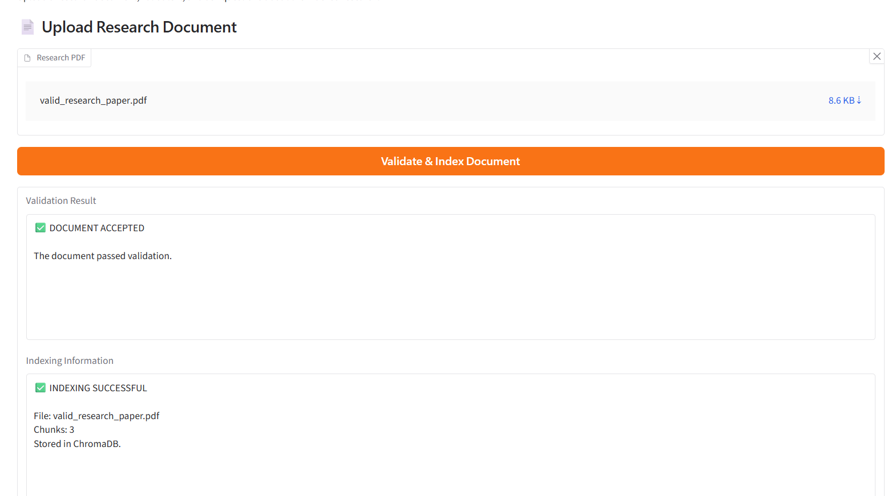
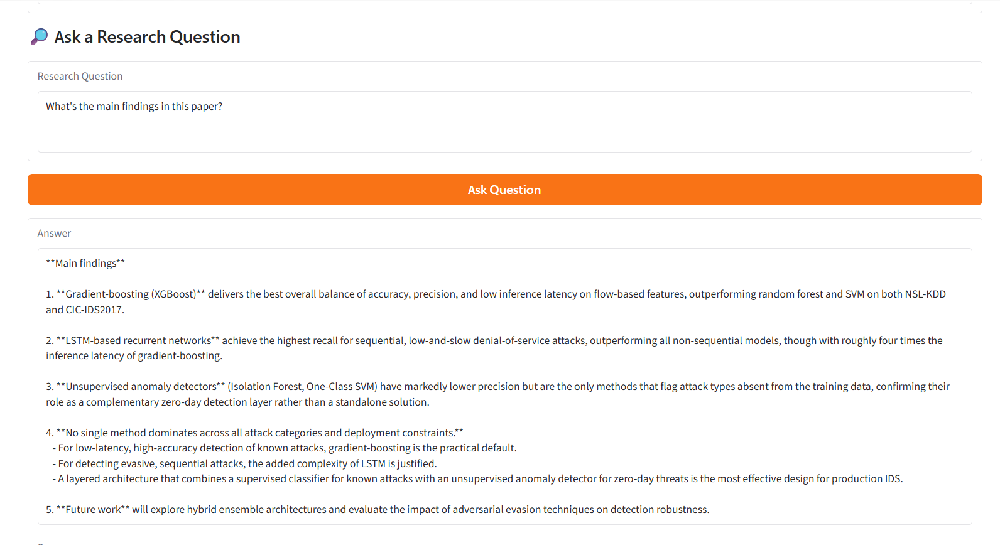

# Academic Research & Literature Discovery Assistant

An AI-powered research assistant for validating, indexing, retrieving,
and answering questions about research documents.

## Project Overview

The system validates incoming research documents before indexing them.
Valid documents are processed, their text is extracted and split into
chunks, embeddings are generated, and the chunks are stored in ChromaDB.

When a user asks a question, the system retrieves relevant research
content and uses an LLM to generate an answer based on the retrieved
content.

## Main Features

- Research PDF validation
- Corrupted PDF detection
- Empty document detection
- Unsupported format detection
- Insufficient extractable text detection
- Duplicate document detection
- Text extraction
- Text chunking
- Embedding generation
- ChromaDB vector storage
- Semantic retrieval
- LLM-based question answering
- Gradio user interface

## System Pipeline

PDF Upload
↓
Document Validation
↓
Text Extraction
↓
Text Chunking
↓
Embedding Generation
↓
ChromaDB
↓
Semantic Retrieval
↓
LLM
↓
Research Answer

## Technologies

- Python
- Google Colab
- PyPDF
- Sentence Transformers
- ChromaDB
- Gradio
- OpenRouter
- Large Language Model (LLM)
- Retrieval-Augmented Generation (RAG)


## User Interface

The system provides a simple and user-friendly Gradio interface that allows users
to upload research documents, validate them, index valid documents, and ask
questions about the indexed research.

### Document Upload, Validation and Indexing

The first part of the interface allows the user to upload a research PDF.
The system displays the validation result and indexing information after
processing the document.



### Research Question Answering

The second part of the interface allows the user to enter a research question.
The system retrieves relevant research content and displays the generated
answer along with the available sources.


## Running the Project

The project can be opened using Google Colab.

Open:

`research_assistant.ipynb`

Run the notebook cells in order.

The final cells launch the Gradio interface.

## API Key

The system can use an OpenRouter API key for live LLM responses.

The API key should NOT be stored directly in the repository.

Set it as an environment variable:

`OPENROUTER_API_KEY`

Example:

```python
import os

os.environ["OPENROUTER_API_KEY"] = "YOUR_API_KEY"
https://github.com/SDAIAAcademy 
